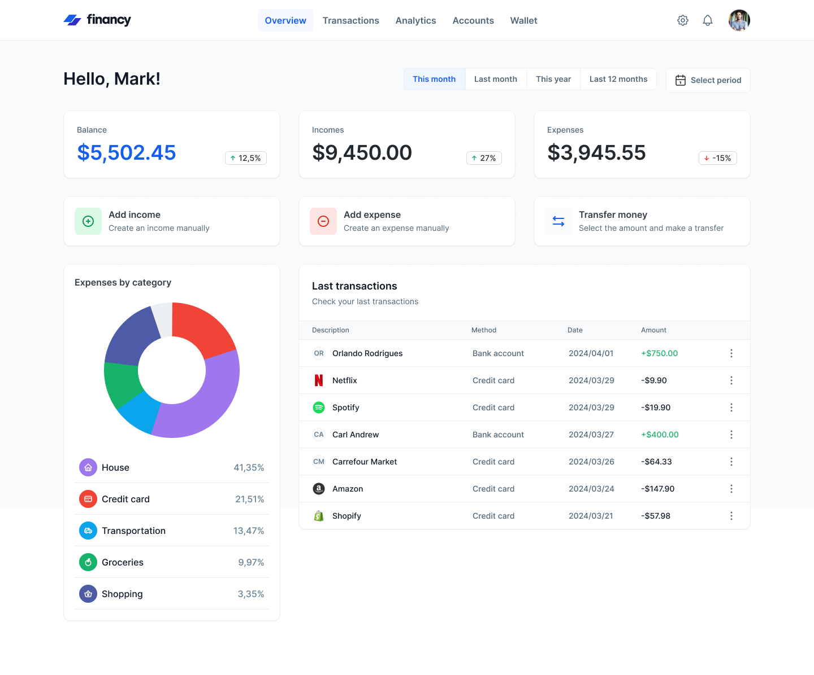

# Financy

Financy é um projeto de controle financeiro desenvolvido em ReactJS com TypeScript. Ele utiliza styled-components para o CSS-in-JS, proporcionando uma experiência de desenvolvimento modular e estilização dinâmica. Este projeto foi inspirado em um layout moderno e intuitivo que facilita o gerenciamento das finanças pessoais.



## Índice

- [Tecnologias Utilizadas](#tecnologias-utilizadas)
- [Funcionalidades](#funcionalidades)
- [Instalação](#instalação)
- [Uso](#uso)
- [Créditos](#créditos)
- [Contribuição](#contribuição)
- [Licença](#licença)

## Tecnologias Utilizadas

- [ReactJS](https://reactjs.org/)
- [TypeScript](https://www.typescriptlang.org/)
- [Styled-Components](https://styled-components.com/)

## Funcionalidades

- **Dashboard Resumida:**
  - Exibição de saldo atual.
  - Visão geral das receitas e despesas.
  - Comparativos percentuais mensais.

- **Gestão de Transações:**
  - Adição manual de receitas.
  - Adição manual de despesas.
  - Transferências entre contas.

- **Despesas por Categoria:**
  - Gráfico de pizza representando a distribuição de despesas por categoria (Casa, Cartão de Crédito, Transporte, Supermercado, Compras).

- **Últimas Transações:**
  - Lista das últimas transações com descrições, métodos de pagamento, datas e valores.

- **Período Personalizado:**
  - Filtro para visualização de dados por período (mês atual, mês passado, ano atual, últimos 12 meses, período personalizado).

## Instalação

Para executar o Financy localmente, siga os passos abaixo:

1. Clone o repositório:
   ```bash
   git clone https://github.com/4ntonio19/financy-frontend/
   ```
2. Navegue até o diretório do projeto:
   ```bash
   cd financy
   ```
3. Instale as dependências:
   ```bash
   npm install ou yarn install
   ```
4. Inicie o servidor de desenvolvimento:
   ```bash
   npm start ou yarn start
   ```

## Uso

Atualmente, o Financy funciona com dados mockados no front-end, sem backend. Após iniciar o servidor, acesse o projeto em seu navegador:
```
http://localhost:5173/
```

## Créditos

Designer: [Nome do Designer](link-para-o-perfil-do-designer)
